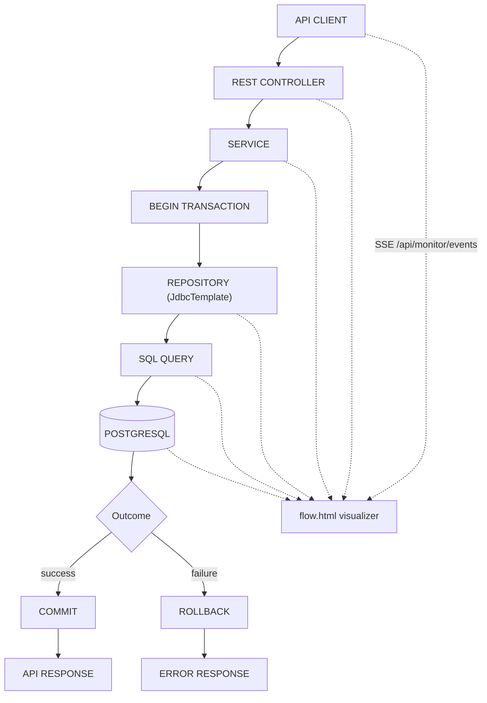

# Banking System Backend

Educational backend banking simulator built with **Java 17, Spring Boot 3.3, JdbcTemplate (explicit SQL), PostgreSQL, JWT security, and Flyway migrations**. No real money moves anywhere — all balances are database rows.

## Features

- User registration / login with BCrypt + JWT (`Bearer` tokens)
- Customer profile management (`GET/PUT /api/customers/me`)
- Bank account creation with backend-generated unique 10-digit account numbers
- Balance inquiry, deposit, withdrawal, account-to-account transfer
- Immutable per-account transaction history (`DEPOSIT, WITHDRAWAL, TRANSFER_IN, TRANSFER_OUT`)
- Ownership authorization on every account/transaction access
- Centralized JSON error responses, Bean Validation, `BigDecimal`-only money math
- Atomic deposits/withdrawals/transfers via `@Transactional` + concurrency-safe SQL
- 15 automated service tests (Mockito), Postman collection included

## Technologies

| Layer        | Choice                                            |
|--------------|---------------------------------------------------|
| Language     | Java 17                                           |
| Framework    | Spring Boot 3.3.5 (Web, JDBC, Security, Validation) |
| DB           | PostgreSQL 16+ (verified against local PG 18)     |
| Migrations   | Flyway (`src/main/resources/db/migration`)        |
| SQL access   | `JdbcTemplate` with handwritten parameterized SQL |
| Auth         | Spring Security + JJWT 0.12.6 (HS256) + BCrypt    |
| Money        | `DECIMAL(19,2)` in SQL, `BigDecimal` in Java      |
| Tests        | JUnit 5 + Mockito                                 |
| Build        | Maven                                             |

## Architecture

Layered architecture — controllers never touch the database, repositories never contain business rules:

```
CLIENT -> REST CONTROLLER -> SERVICE -> REPOSITORY -> SQL QUERY -> DATABASE
```

```
src/main/java/com/example/banking/
  BankingApplication.java
  config/SecurityConfig.java        stateless filter chain, public POST /api/auth/**
  controller/                       Auth, Customer, Account, Transfer controllers
  dto/                              request/response records (validation on requests)
  exception/                        custom exceptions + @RestControllerAdvice handler
  model/                            plain POJOs (User, Customer, Account, BankTransaction) + enums
  repository/                       User/Customer/Account/TransactionRepository (JdbcTemplate + SQL)
  security/                         JwtUtil, JwtAuthenticationFilter, CustomUserDetailsService
  service/                          Auth, Customer, Account, Transfer services (@Transactional)
  util/BankingIds.java              account-number + reference-number generators
```

## Project Structure (other files)

```
pom.xml                             Spring Boot parent + dependencies
src/main/resources/application.yml  env-placeholder config (DB_URL, JWT_SECRET, ...)
src/main/resources/db/migration/    V1..V5 Flyway migrations (PostgreSQL)
src/test/.../service/               AuthServiceTest, AccountServiceTest, TransferServiceTest
docker-compose.yml                  optional Postgres 16 container
.env.example                        placeholder env values (no real secrets)
postman_collection.json             ordered API test collection
```

## Database Design

One database: `banking_system_db`. Four tables, all created by Flyway migrations.

- `users(id, username UNIQUE, email UNIQUE, password_hash, role, status, created_at, updated_at)`
- `customers(id, user_id UNIQUE -> users.id, first_name, middle_name, last_name, phone, address, ...)`
- `accounts(id, customer_id -> customers.id, account_number UNIQUE, account_type, balance DECIMAL(19,2) CHECK >= 0, status, ...)`
- `transactions(id, reference_number UNIQUE, account_id -> accounts.id, related_account_id -> accounts.id NULL, transaction_type, amount CHECK > 0, balance_before, balance_after, description, created_at)`

Indexes cover `account_number`, `reference_number`, `account_id`, `created_at`, usernames/emails.

### Database Relationships (ER diagram)

```mermaid
erDiagram
    USERS ||--|| CUSTOMERS : "has profile"
    CUSTOMERS ||--o{ ACCOUNTS : owns
    ACCOUNTS ||--o{ TRANSACTIONS : "has history"
    ACCOUNTS ||--o{ TRANSACTIONS : "related counterparty"
    USERS {
        bigint id PK
        varchar username UK
        varchar email UK
        varchar password_hash
        varchar role
        varchar status
    }
    CUSTOMERS {
        bigint id PK
        bigint user_id FK_UK
        varchar first_name
        varchar last_name
    }
    ACCOUNTS {
        bigint id PK
        bigint customer_id FK
        varchar account_number UK
        varchar account_type
        decimal balance
        varchar status
    }
    TRANSACTIONS {
        bigint id PK
        varchar reference_number UK
        bigint account_id FK
        bigint related_account_id FK
        varchar transaction_type
        decimal amount
        decimal balance_before
        decimal balance_after
    }
```

## Setup Instructions

Prerequisites: JDK 17, Maven 3.9+, PostgreSQL 13+.

1. Create database and user:
   ```sql
   CREATE ROLE banking LOGIN PASSWORD 'banking';
   CREATE DATABASE banking_system_db OWNER banking;
   ```
   Or: `docker compose up -d postgres` (uses the same credentials).
2. Export environment (or copy `.env.example` values into your shell):
   ```powershell
   $env:DB_URL="jdbc:postgresql://localhost:5432/banking_system_db"
   $env:DB_USERNAME="banking"
   $env:DB_PASSWORD="banking"
   $env:JWT_SECRET="a-long-random-secret-of-at-least-32-characters"
   ```
3. Build and test:
   ```powershell
   mvn test
   mvn package -DskipTests
   ```

## Environment Variables

| Variable         | Default (dev)                                              | Purpose              |
|------------------|------------------------------------------------------------|----------------------|
| `DB_URL`         | `jdbc:postgresql://localhost:5432/banking_system_db`       | JDBC URL             |
| `DB_USERNAME`    | `banking`                                                  | DB user              |
| `DB_PASSWORD`    | `banking`                                                  | DB password          |
| `JWT_SECRET`     | `replace_with_secure_secret_min_32_chars_long_please`      | HS256 signing key (min 32 chars) |
| `JWT_EXPIRATION` | `86400000` (24h)                                           | Token TTL in ms      |
| `SERVER_PORT`    | `8080`                                                     | HTTP port            |

Flyway runs automatically on startup (`V1..V5`), so the schema is reproducible from source.

## Running the Application

```powershell
mvn spring-boot:run
# or
java -jar target/banking-backend-0.0.1-SNAPSHOT.jar
```

The API listens on `http://localhost:8080`.

## Authentication

JWT flow: `POST /api/auth/login` verifies BCrypt credentials and returns a token. Send it as `Authorization: Bearer <token>` on every other call. Only `POST /api/auth/register` and `POST /api/auth/login` are public; all banking endpoints verify that the caller owns the account involved.

## API Endpoints

| Method | Endpoint                                | Description                  |
|--------|-----------------------------------------|------------------------------|
| POST   | `/api/auth/register`                    | Register user + profile      |
| POST   | `/api/auth/login`                       | Login, receive JWT           |
| GET    | `/api/customers/me`                     | Own profile                  |
| PUT    | `/api/customers/me`                     | Update profile               |
| POST   | `/api/accounts`                         | Create account (`SAVINGS`/`CHECKING`) |
| GET    | `/api/accounts`                         | List own accounts            |
| GET    | `/api/accounts/{accountId}`             | Account details              |
| GET    | `/api/accounts/{accountId}/balance`     | Balance inquiry              |
| POST   | `/api/accounts/{accountId}/deposit`     | Deposit                      |
| POST   | `/api/accounts/{accountId}/withdraw`    | Withdraw                     |
| POST   | `/api/transfers`                        | Transfer (by account number) |
| GET    | `/api/accounts/{accountId}/transactions`| Paginated history (`page`, `size`) |
| GET    | `/api/transactions/{transactionId}`     | Single transaction           |

Example transfer request:

```json
{
  "sourceAccountNumber": "1000000001",
  "destinationAccountNumber": "1000000002",
  "amount": 1000.00,
  "description": "Transfer"
}
```

All responses use `{ "success", "message", "data", "timestamp" }`; errors never leak SQL, stack traces, hashes, or secrets. See `postman_collection.json` for the full ordered walkthrough (register -> login -> create -> deposit -> balance -> transfer -> withdraw -> history).

## SQL Data Flow

Every repository method is handwritten parameterized SQL (`?` placeholders — no string concatenation, SQL-injection safe). Key statements:

```sql
-- Create user / find login identity
INSERT INTO users (username, email, password_hash, role, status) VALUES (?, ?, ?, ?, ?);
SELECT * FROM users WHERE username = ? OR email = ?;

-- Deposit (atomic increment, active-only)
UPDATE accounts SET balance = balance + ?, updated_at = NOW()
WHERE id = ? AND status = 'ACTIVE';

-- Withdrawal (conditional update: never goes negative, even concurrently)
UPDATE accounts SET balance = balance - ?, updated_at = NOW()
WHERE id = ? AND status = 'ACTIVE' AND balance >= ?;

-- Transfer locking (both rows, one transaction)
SELECT * FROM accounts WHERE account_number = ? FOR UPDATE;

-- History (newest first, paginated)
SELECT * FROM transactions WHERE account_id = ?
ORDER BY created_at DESC, id DESC LIMIT ? OFFSET ?;
```

## Banking Transaction Flow

### Login flow

```
CLIENT -> AUTH CONTROLLER -> AUTH SERVICE -> USER REPOSITORY -> SQL -> DATABASE -> JWT
```

### Deposit flow

```
POST -> auth -> validate account + amount -> UPDATE balance = balance + ?
-> INSERT transaction row -> COMMIT -> response (all in one @Transactional method)
```

### Transfer flow

```
CLIENT -> TRANSFER CONTROLLER -> TRANSFER SERVICE -> BEGIN TRANSACTION
-> SELECT ... FOR UPDATE (both accounts, id-ordered to avoid deadlocks)
-> validate active + sufficient funds -> UPDATE sender -> UPDATE receiver
-> INSERT TRANSFER_OUT + TRANSFER_IN records -> COMMIT -> RESPONSE
```

Any failure before commit rolls back the whole transfer — money can never be debited without being credited.

## Concurrency

- **Deposits**: single atomic `UPDATE ... balance + ?` — no read-modify-write race.
- **Withdrawals**: conditional `UPDATE ... WHERE balance >= ?`; affected-row count decides success, so two concurrent withdrawals cannot both spend the same funds (the DB `CHECK (balance >= 0)` is a second guard).
- **Transfers**: `SELECT ... FOR UPDATE` row locks serialize concurrent transfers on the same accounts; locks are always taken in ascending-id order to prevent deadlocks.

## Testing

```powershell
mvn test
```

15 Mockito service tests, all passing: registration (success/duplicates), login (success/wrong-password/disabled), deposit (success/zero-rejected), withdrawal (success/insufficient/unauthorized), transfer (success/same-account/insufficient-rollback/unauthorized-source). Rollback behavior is verified by asserting no balance updates and no transaction rows are written when validation fails; atomicity itself is provided by Spring `@Transactional` over a single JDBC connection.

## Security Notes

- Passwords hashed with BCrypt; JWT secret and DB credentials come from environment variables only.
- Parameterized queries everywhere; ownership checks on every account/transaction access.
- Stateless sessions, no stack traces or internal errors in API responses.

## Future Improvements

- ADMIN role endpoints, account freeze/close operations
- Pagination metadata envelope, idempotency keys for transfers
- Integration tests with Testcontainers PostgreSQL, rate limiting, audit logging

## Live Backend Data Flow Visualization

### 1. Purpose

An educational, read-mostly dashboard that shows **real** backend activity: every API
request is traced through `CLIENT -> CONTROLLER -> SERVICE -> REPOSITORY -> SQL ->
DATABASE -> RESPONSE`, with `BEGIN / COMMIT / ROLLBACK` transaction states. It is a
backend monitor, not a customer banking frontend — nothing here duplicates business
logic; the demo panel simply calls the existing REST endpoints.

### 2. Architecture

```
BROWSER (flow.html, EventSource)
   ^ SSE  GET /api/monitor/events   (text/event-stream)
   |      GET /api/monitor/history (recent events, JSON)
   |      GET /api/monitor/status  (real backend + DB status)
SPRING BOOT
   RequestIdFilter (X-Request-ID correlation, REQUEST/RESPONSE events)
   -> JwtAuthenticationFilter (AUTH events, Bearer ********)
   -> FlowInterceptor (CONTROLLER entry events)
   -> Service layer (SERVICE + TRANSACTION BEGIN/COMMIT/ROLLBACK via FlowPublisher)
   -> Repository layer (real parameterized SQL text via FlowPublisher.sql)
   -> PostgreSQL (DATABASE + COMMIT/ROLLBACK outcome events)
   FlowEventBus fans out to SSE subscribers + keeps last 300 events in memory.
```

Event JSON shape:

```json
{
  "requestId": "REQ-20261002-00021",
  "timestamp": "2026-10-02T12:31:04.231Z",
  "type": "SQL",
  "layer": "SQL",
  "operation": "TRANSFER",
  "method": "POST",
  "endpoint": "/api/transfers",
  "status": "RUNNING",
  "durationMs": 12,
  "message": "Executing SQL",
  "sql": "UPDATE accounts SET balance = balance - ? WHERE id = ? AND balance >= ?"
}
```

### 3. How live events are generated

- `RequestIdFilter` (highest precedence) assigns `X-Request-ID` (`REQ-YYYYMMDD-NNNNN`),
  publishes `REQUEST` on entry and `RESPONSE` (real HTTP status + duration) on exit.
- `FlowInterceptor` publishes `CONTROLLER` entry inside the DispatcherServlet.
- `AuthService` publishes `SERVICE`/`AUTH`/`TRANSACTION` events (JWT issued, never logged).
- `AccountService` / `TransferService` / `CustomerService` publish `SERVICE` step events
  (validation, balance checks, debit/credit) and `TRANSACTION BEGIN`; true COMMIT/ROLLBACK
  outcomes are published via Spring `TransactionSynchronization` callbacks.
- Repositories (`Account/User/Customer/TransactionRepository`) publish the **actual SQL
  string** they execute plus a `DATABASE` rows-affected note for writes.
- `GlobalExceptionHandler` publishes `ERROR` events (message only, no stack traces).

### 4. How the browser receives events

`src/main/resources/static/flow.js` opens an `EventSource` to `/api/monitor/events`
(Server-Sent Events — backend-to-browser push, no extra infrastructure). On load it also
fetches `/api/monitor/history` so recent activity is visible immediately, and polls
`/api/monitor/status` for the backend/database health chips.

### 5. How layers are visualized

Each pipeline node (`CLIENT, AUTH, CONTROLLER, SERVICE, REPOSITORY, SQL, DATABASE,
TRANSACTION`) moves through `IDLE -> RUNNING -> SUCCESS`, or `FAILED` / `ROLLED_BACK`
on errors. A failed transfer visibly rolls back: service node `FAILED`, transaction and
database nodes `ROLLED_BACK`, plus a "TRANSACTION STATUS: ROLLED BACK" banner with the
reason. Tables touched by the current operation (`users/customers/accounts/transactions`)
are highlighted; SQL text renders in the SQL inspector; requests accumulate in the live
event log, request inspector, and API activity table.

### 6. How to start the application

```powershell
$env:DB_URL="jdbc:postgresql://localhost:5432/banking_system_db"
$env:DB_USERNAME="banking"
$env:DB_PASSWORD="banking"
$env:JWT_SECRET="a-long-random-secret-of-at-least-32-characters"
mvn spring-boot:run
# or: java -jar target/banking-backend-0.0.1-SNAPSHOT.jar
```

### 7. Visualization URL

`http://localhost:8080/flow.html` — open it, then register/login/deposit/transfer from
the built-in demo panel (or Postman) and watch the pipeline light up with real events.

### 8. Example deposit workflow

`POST /api/accounts/1/deposit` → CLIENT → AUTH (JWT ok) → CONTROLLER →
SERVICE (validate amount) → TRANSACTION BEGIN → REPOSITORY →
`UPDATE accounts SET balance = balance + ? ...` → DATABASE (1 row) →
`INSERT INTO transactions ...` → COMMIT → `200 OK` (~30 ms).

### 9. Example withdrawal workflow

Same shape as deposit, but the SQL is the guarded conditional update
`UPDATE accounts SET balance = balance - ? ... WHERE ... AND balance >= ?`. If the
balance check fails, the UI shows `SERVICE FAILED` at "BALANCE CHECK" and
`TRANSACTION ROLLED_BACK` — no balance change, `400 Insufficient balance`.

### 10. Example transfer workflow

`POST /api/transfers` → TRANSFER SERVICE → BEGIN → `SELECT ... FOR UPDATE` (both rows,
id-ordered) → ownership/active/balance checks → `UPDATE` source (debit) → `UPDATE`
destination (credit) → `INSERT TRANSFER_OUT` + `INSERT TRANSFER_IN` → COMMIT → response
with `sourceBalanceAfter` and shared reference number.

### 11. Rollback visualization

Any transfer failure (insufficient funds, same account, inactive/unauthorized account)
aborts before commit: the event stream shows `Transaction ROLLBACK: <reason>` plus
`Database ROLLBACK - changes discarded`, the transaction/database nodes turn purple
`ROLLED_BACK`, and balances are provably unchanged (verified live: 900.00 / 50.00
untouched by three consecutive rejected operations).

### 12. Security / masking behavior

Events never contain passwords, password hashes, JWT secrets, DB passwords, or full
tokens — `Authorization: Bearer <token>` is rendered as `Bearer ********`, and
`password/secret` assignments are masked. `/api/monitor/*` (GET) and `/flow.html` are
public for classroom demo; all banking endpoints still require a valid JWT.

### Live workflow diagram


